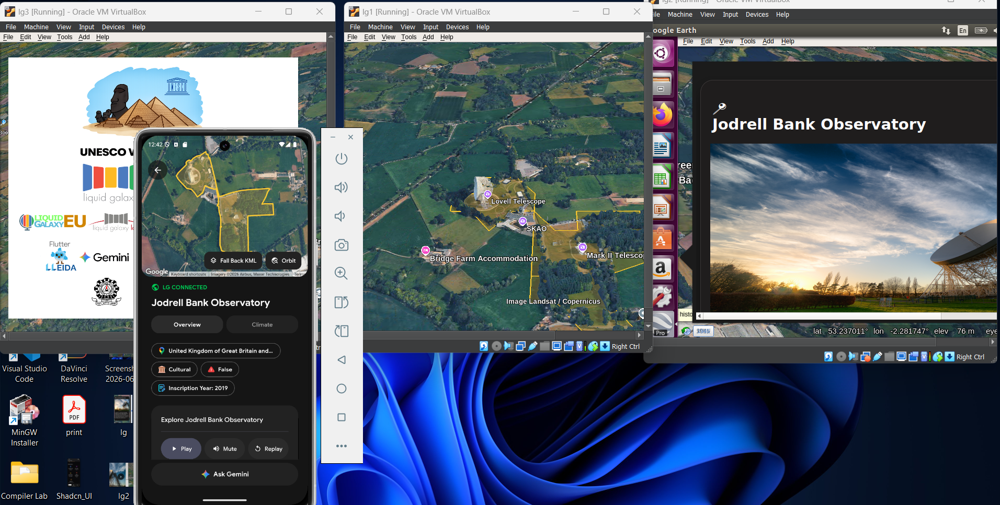
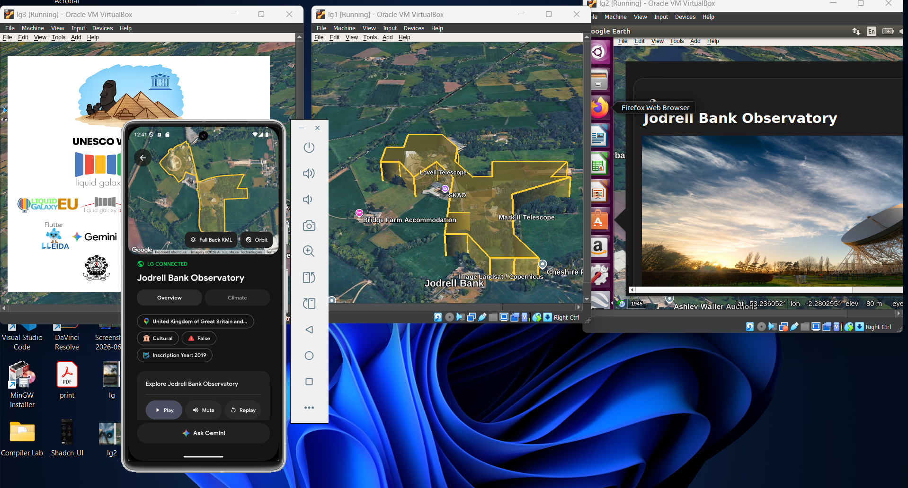
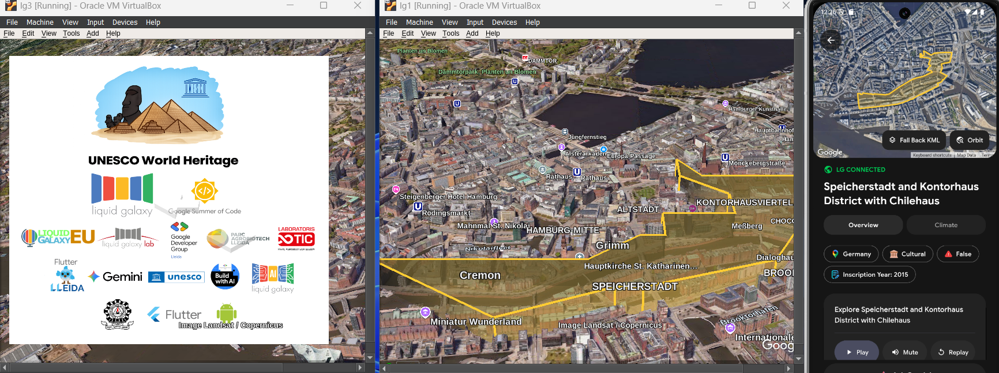

# UNESCO World Heritage for Liquid Galaxy

[](https://flutter.dev)
[](https://dart.dev)
[](https://developer.android.com)
[](https://www.liquidgalaxy.eu)
[](https://summerofcode.withgoogle.com)
[](#license)

A Flutter Android application for exploring UNESCO World Heritage Sites on a
Liquid Galaxy rig.

The app lets users discover cultural, natural, and mixed heritage sites, view
site details, ask Gemini questions, listen to generated stories, and send
Google Earth KML scenes to a multi-screen Liquid Galaxy installation.

This project was built as part of Google Summer of Code 2026 with the Liquid
Galaxy organization.

## Demo

The app connects a mobile controller to a Liquid Galaxy rig and renders UNESCO
site boundaries, orbit tours, splash screens, and information panels across the
screens.

| Mobile controller and LG scene | Extruded KML boundary | Multi-screen LG output |
| --- | --- | --- |
|  |  |  |

## What It Does

- Explore UNESCO World Heritage Sites from a mobile interface.
- Search and filter sites by name, country, region, category, inscription year,
  and danger status.
- Connect to a Liquid Galaxy rig over SSH.
- Send site KML, boundary overlays, info balloons, logos, and orbit tours to LG.
- Fly Google Earth to selected sites and synchronize the in-app map camera with
  the rig.
- Ask Gemini questions about a selected site.
- Generate and play short narrated site stories.
- Show current weather and best-time-to-visit information where available.
- Control common LG actions such as relaunch, reboot, clean KML, clean logo, and
  power off.

## Screens And Flow

- **Home**: shows nearby or featured heritage sites.
- **Search**: full site search with filters.
- **Site Details**: map preview, boundary rendering, LG fly-to, orbit, climate,
  story playback, and Gemini chat.
- **API Authentication**: stores Gemini and Google Maps API keys locally.
- **Settings**: stores LG SSH configuration and exposes rig commands.
- **About**: project information, credits, data sources, and help.

## Tech Stack

- **Flutter / Dart** for the Android app.
- **Riverpod** for state management.
- **dartssh2** for SSH communication with Liquid Galaxy.
- **Google Maps WebView** for map previews.
- **Google Generative AI / Gemini** for chat and story generation.
- **Speech-to-text and PCM audio playback** for voice interaction and narration.
- **Hive and SharedPreferences** for local app storage.
- **UNESCO, ArcGIS, Open-Meteo, and bundled JSON assets** for site, geometry, and
  climate-related data.

## Requirements

- Flutter SDK with Dart `^3.10.4`.
- Android device or Android emulator.
- Internet connection for maps, images, APIs, and live data.
- Liquid Galaxy rig or compatible LG VM setup.
- Gemini API key for AI features.
- Google Maps API key for map previews.

Check your local Flutter setup:

```bash
flutter doctor
```

## Setup

Clone the repository:

```bash
git clone https://github.com/LiquidGalaxyLAB/unesco-world-heritage.git
cd unesco-world-heritage
```

Install dependencies:

```bash
flutter pub get
```

Create a `.env` file if needed and add your Google Maps key:

```env
GOOGLE_MAPS_API_KEY=your_google_maps_api_key
```

You can also save the Google Maps API key and Gemini API key from the app's
**API Authentication** screen.

Run the app:

```bash
flutter run
```

## Liquid Galaxy Setup

Open **Settings** in the app and enter:

- Master node IP address
- SSH port, usually `22`
- LG username, usually `lg`
- LG password
- Number of screens in the rig

After connecting, the app can send KML files, start orbit tours, show site
balloons, clear KML, relaunch LG, reboot LG, and power off the rig.

## Build APK

Debug APK:

```bash
flutter build apk --debug
```

Release APK:

```bash
flutter build apk --release
```

The release APK is generated at:

```text
build/app/outputs/flutter-apk/app-release.apk
```

If Kotlin cache errors appear on Windows because the project and Pub cache are
on different drives, keep the Pub cache on the same drive as the project before
building:

```powershell
$env:PUB_CACHE = "D:\PubCache"
flutter clean
flutter pub get
flutter build apk --release
```

## Project Structure

```text
lib/
  core/                 Theme, constants, providers, KML helpers
  data/                 Services and repository implementations
  domain/               Models and repository contracts
  ui/features/          App screens, widgets, and view models

assets/
  images/               App images and project logos
  font/                 GoogleSans font files
  whc_site_bestTimeVisit.json
```

## Data And APIs

This app uses public and third-party services to enrich the heritage site
experience:

- UNESCO World Heritage data
- ArcGIS geometry data
- Open-Meteo weather data
- Google Maps
- Google Gemini

API availability, quotas, and keys are controlled by their respective providers.

## Credits

Created and maintained by **Saumya Bhattacharya** as a Google Summer of Code
2026 project with **Liquid Galaxy**.

Mentors:

- Yash Raj Bharti
- Rohit Kumar

Organization admin:

- Andreu Ibanez

Thanks to the Liquid Galaxy community for guidance, testing, and support.

## Repository

GitHub:

```text
https://github.com/LiquidGalaxyLAB/unesco-world-heritage
```

## License

Please refer to the repository license or organization policy for usage and
distribution terms.
